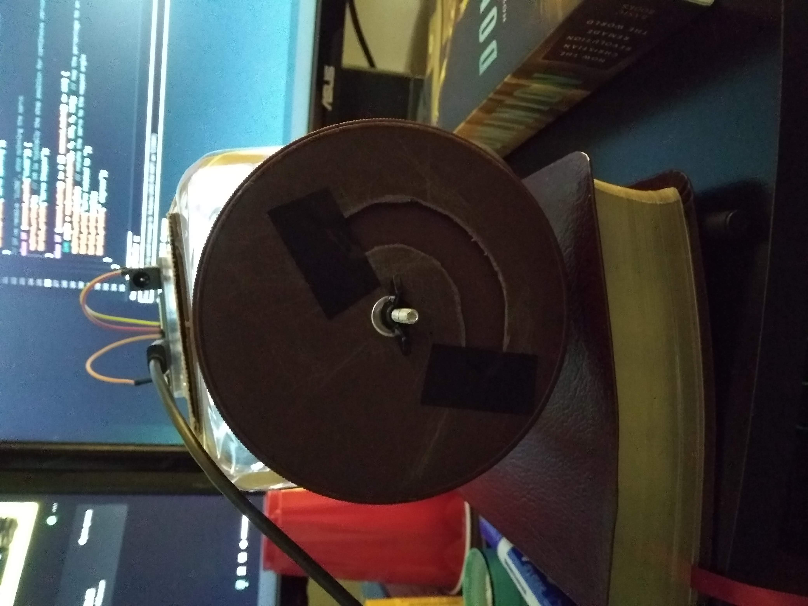

# Introduction

I saw this tweet a few weeks ago:

I thought it'd be fun to build an actuator and control system, so I got to work.

## Table of Contents

- [1. Initial planning & simulating](#section-1)
- [2. Assembling the hardware](#section-2)
- [3. Testing time!](#section-3)
- [4. Things I learned](#section-4)
- [5. Things I'd do differently](#section-5)

---

### 1. Initial planning & simulating

I've never built an actuator and control system, so I got ChatGPT to describe the mechanism and break it down into pieces.  I made an outline for the project and got to work.  I figured that the electronics would be the most difficult part, so I started there.  After evaluating a few dispersal options, I decided to keep things simple and implement a trapdoor mechanism to release the material.  Also, I decided to use salt as our cloud seeding material.

I decided to use hardware simulation software to plan out the system.  I found a tool called tinkercad that was really good for this.  I was able to simulate a circuit board, servomotor, and the connections between them.  It also has a basic IDE in it, so you can actually operate the servomotor.  It uses C++; my programming skills mostly involve python and javascript, but with a bit of help from ChatGPT, I was able to make a simple program that did everything I wanted it to do.  We'll go into more detail on that later.

_Software simulation_

Once I was satisfied with the electrical components, I ordered a circuit board and a servo motor online and started working on a container to hold and disperse the salt.  I just wanted something simple and functional - something that could hold salt, then disperse it on command.  I had a bunch of ideas for how I wanted it to work ideally, but I didn't have the materials for anything too high-tech.  We'd have MacGyver this thing.

---

### 2. Assembling the hardware

I stopped by a family member's house to borrow some tools, and they suggested I use this giant M&M container to hold the salt.

_You might not like it, but this is what_
_peak technological supremacy looks like_

I cut a hole in the lid, and cut out a second piece of plastic to cover the hole until I sent the command to open it.  Once the electronics arrived, I was able to hook up the servo motor to the opening, and then hook the servo motor up to the circuit board.

_Servo motor-lid junction_

_Servo motor - circuit board connection_

Once I had the components working, I set about salt-proofing all of the fine mechanical parts.  I was able to drill a very narrow hole in the bottom of a plastic cup to feed the servo motor through while keeping it safe from salt.

_High-tech salt seal_

In the above picture, you can see the opening in the lid.  When the servo motor activates, it will turn the brown plastic to cover, or uncover, the opening. You'll see a video of this shortly.

I fastened the servo motor into the main container and tied it down, to keep it stable:

_Image from above_

With the internal components completed, all I had to do was affix the circuit board.

_Starting to look legit_

At this point, we are ready for testing.  To pull it all together, this is what the bottom of the system looks like.

_Closed_

_Opened_

I set it up outside - I really didn't feel like spilling a bunch of salt inside the house:

_Time to shine_

---

### 3. Testing time!

Here is a short video demonstrating a test run.

After testing a few software functions, I realized that I wanted more precise control over the amount of salt we can disperse at any given moment.  I wanted to be able to titrate the exact amount of salt that would be optimal to disperse at any given moment.  So, I made a function that lets you specify the exact size of the opening.  The program accepts any number between 0 and 100 (if you type something else, nothing happens).  The number corresponds to a given percentage of the size of the opening.  So, if you type 0, the actuator is 0% open (in other words, closed).  If you type in 100, then the actuator is 100% open.  In the video, I tested a few settings.  It starts at 0, then works its way through 25, 50, 75, and 100 before returning to 0.

With that demonstration out of the way, I was able to move on to the real deal - actually dispersing salt.  Here is the video demonstrating the salt dispersal.

Here, we're starting at 0, before working up to 10, 20, 30, then back to 0.  (I tested 100 the first time I did this, but the salt flowed out WAY faster than I was expecting lol).  I don't know about you, but that looks like a success to me!

_Slightly more detailed explanation:_
The circuit board I'm using supports a custom integrated development environment (IDE) made by the manufacturer.  I transferred my original code from the simulator into the IDE.  It also has an input interface called the Serial Monitor (at the bottom of the screenshot) that lets you send any command to the circuit board.  You can faintly hear me typing these commands in the videos.

---

### 4. Things I learned

This is going to be a long list.  In no particular order:

- I thought that the electronics would be the hard part, but honestly that was pretty easy.  I underestimated the power of the simulation software.  I was able to just copy my code from the simulator to the IDE, arrange the wires appropriately, and the servo motor worked on the first try.
- In contrast, the non-electrical components were both more labor-intensive and (in some ways) more complicated.  I often found that I would plan to attach two components in a certain way, only to realize that my current arrangement prevented me from physically reaching the things I needed to reach.  I did a bunch of this sort of stuff as a kid, but I could tell I was a little rusty.
- I skimmed over a bit of detail in the electronics section - what actually happened wasn't quite so neat.  When I first ordered the circuit board, nothing worked.  I spent days debugging it before concluding that it was ultimately faulty hardware.  I ordered a new one and it worked instantly with zero setup.  Counting up the days I spent waiting for the first board to ship, the days spent debugging it, and the days waiting for a replacement, I lost about a week.  This is pretty significant, considering the whole project took about two weeks.  In hindsight, I should've had more faith in my debugging skills and gotten my hands on a replacement ASAP.
- I learned that there's actually a ton of commercial-grade electrical components and free builder tools out there, and building these sorts of projects is actually much easier than I would have assumed.  Now I'm thinking of other things you could build with this stuff.
- On a related note, chatbots like ChatGPT and Perplexity were really, really good at all levels of the project.  Right now it seems like everybody's using AI for office work, but it was able to walk me through outlining the project, explaining concepts I was unfamiliar with, explaining the pros and cons of various options I had to decide between (what cloud seeding material to use, what simulation software to use, what circuit boards to use, what type of servo motor would be appropriate... the list goes on and on).  This is in addition to its normal use as a coding copilot.  AI was able to speed me up far beyond what I would have been able to do alone.
- Building hardware is much more fun than building software.

---

### 5. Things I'd do differently

If I had to do this again, what would I do differently?

It would depend on what resources I had available.  Throughout this project, I kept thinking, man, a 3-d printer would really come in handy right now.  Obviously we'd want to replace the salt container with something that isn't a meme.  Something that would form an airtight seal and could be attached to the underside of a drone.  A 3-d printer would let you tailor the exact dimensions of the container to that of the drone you're using.

Relatedly, we could build a dispersal mechanism with a tighter seal.  In the final video, you might have noticed a small trickle of salt, even when the actuator was supposed to be completely closed.  Custom-printed parts would allow for more precise and secure seals.

The main thing I've been thinking about, though, is implementing wireless functionality.  Right now, the actuator only works when connected to a computer via USB.  Presumably, you'd want a way to control the actuator from the ground (though I suppose some kind of on-board computer might work.  I don't know how you have your drones set up).  My circuit board has some WiFi/Bluetooth capabilities, but the ranges on those are far too short for anything you'd send up into a cloud.  I've researched a few options for long-range wireless communication, like radio or satellite, but I'd have to go hunting for some additional hardware to set that up.  I might play around with the bluetooth capabilities a bit, just for fun.

I deliberately made everything about the actuator bigger than it needed to be, just to make it easier to work with.  This applies to everything from the size of the salt container to the size of the dispersal opening - the first time I opened it up 100% with salt inside, it dumped everything before I could close it.  This pairs with the 3-d printer thing - it'll be easy to cut down on excess size once you're using custom-made parts.

I also wasn't totally satisfied with a simple trapdoor mechanism that dropped the salt straight down - it seems like you should be able to get better dispersal with more of a "spray" than a "drop".  I did some research and saw a few mechanisms for this, like aerosolizing the seeding material.  That seems like it might be overly complicated/expensive, though.  I had this crazy idea for attaching something like a seed spreader to the bottom of the actuator, like the kind that gardeners use:

Basically, when you rotate the mechanism (easily done with a circular servo motor) it'll launch the salt horizontally, increasing dispersion.  This would cut down on battery life somewhat, but I don't think it would be too bad, especially since you don't need nearly as much torque as, say, the drone propellers.  After tinkering a bit, I realized that I'd need a 3-d printer to make a version of this that doesn't suck, so I shelved it.  I'm still thinking of ways to make it work, though.
